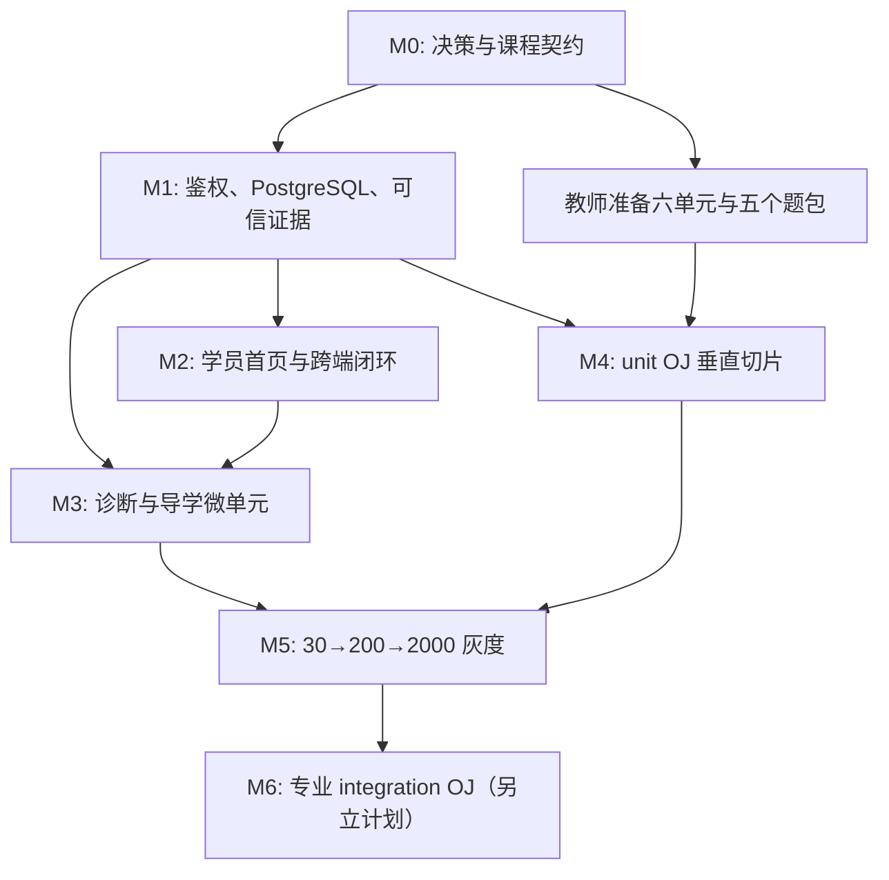

# 工作方案：倒金字塔训练营、学员闭环与 OJ Phase A/B

**日期**：2026-07-14  
**状态**：待产品与基础设施决策确认后开工  
**输入**：[倒金字塔与 OJ 设计](./2026-07-14-funnel-oj-phase-ab-design.md)、[OJ-first 计划](./2026-07-14-lab-gates-oj-first.md)  
**目标**：把当前演示型学习壳，逐步建设为可服务“导学约 2,000 人、项目约 60 人”的训练营系统；先建立可信学习证据和基础 unit OJ，再进入专业 rCore integration OJ。

## 1. 结论先行：实施策略

不直接从当前静态分析跳到“全量 Docker OJ”。本方案采用五个可独立验收的里程碑：

```text
M0 课程与生产前提冻结
  → M1 可信身份、数据库迁移、进度证据
  → M2 学员首页与跨端学习闭环
  → M3 导学诊断与微单元分流
  → M4 unit OJ 垂直切片
  → M5 灰度、容量与运营验收
  →（数据达标后）M6 integration OJ / 专业实验
```

每个里程碑都可暂停、演示和回滚。只有上一里程碑的验收条件全部成立，下一阶段才允许扩大范围。

## 2. 当前基线与必须先解决的风险

| 现状 | 影响 | 本方案的处理 |
|---|---|---|
| 摸底固定 5 题，结果直接更新 `currentStage` | 入口分流不稳定，容易误导学生 | M3 改为 12 题诊断 + 微单元小测；诊断只推荐起点 |
| 地图把当前阶段之前标为 done，今日三步点击即可完成 | “看过/个人勾选/课程达标”混淆 | M1/M2 引入统一证据状态与诚实文案 |
| 计划完成态主要存 localStorage | 换设备丢失，助教无法判断真实投入 | M1 迁移为服务端 `DailyTaskProgress` |
| API 依赖客户端传入 `studentId` | 学员可查看或伪造他人进度，OJ 不可信 | M1 先完成认证、会话与资源所有权校验 |
| Prisma 使用 SQLite，且 OJ schema 尚无 migration | 不适合多 worker/生产并发；当前改动不可交付 | M1 生成可审阅 migration；生产改用 PostgreSQL |
| 提交只做 `STATIC` 静态分析 | 不能称为 OJ，也不能用于晋级 | M4 引入 PENDING→真实 verdict 的 Docker 判题闭环 |

**硬门槛**：未完成身份鉴权、PostgreSQL 与 worker 隔离前，不允许把实验 AC、项目候选或批量学员数据用于正式运营。

## 3. 借鉴对象与可采纳模式

本环境未能访问外网完成逐页核验；以下是待开工时由负责人复核的公开参考清单，而不是对外部产品细节的逐字断言。

| 参考 | 借鉴的模式 | 本项目的落地边界 |
|---|---|---|
| [Rustlings](https://github.com/rust-lang/rustlings) | 小而单一的练习目标、局部反馈、逐步推进 | 基础 Rust/unit OJ 采用单文件或小 crate；不搬运其题目或把整仓放入网页 |
| [GitHub Classroom](https://docs.github.com/en/education/manage-coursework-with-github-classroom) | 课程/作业版本、自动反馈、教师查看提交 | 专业阶段采用“基线仓库 + patch + 提交时间线”；不把 GitHub 当判题沙箱 |
| [PrairieLearn](https://prairielearn.readthedocs.io/) | 题目与评测逻辑分离、可复测、面向大班教学的统计 | 导学使用版本化题库、题目集合和证据聚合；不在 P0 建复杂公式题平台 |

借鉴原则：保留“短闭环”“可审计提交”“教师可运营”三件事；不引入本项目当前不需要的 LTI、复杂组卷引擎、竞赛级分布式调度或网页 IDE。

## 4. 开工前决策（M0，1–2 人日）

### 4.1 必须拍板的决策

| 决策 | 推荐默认值 | 负责人 | 未决风险 |
|---|---|---|---|
| 身份体系 | 学号/邮箱登录，服务端 session；所有 API 从 session 推导 student | 产品 + 后端 | 无法保护成绩与提交 |
| 正式数据库 | PostgreSQL（可使用 Supabase），SQLite 仅本地开发 | 后端/运维 | 多 worker 锁冲突、不可审计 |
| 判题部署 | 独立 Linux Docker worker；Web 服务不直接运行用户代码 | 运维/后端 | Serverless/Windows 无法安全承载 |
| 第一批基础 gate | `env-check`、variables、ownership、Result、syscall-model 五题 | 教师 + 内容 | 题目目标与课程脱节 |
| 导学必修单元 | 六单元：OS 总览、进程、内存、Rust、所有权/错误处理、工具链 | 教师 | 无法给出明确晋级条件 |
| cohort 节奏 | 批次起止时间、项目候选人工复核时间窗 | 教学运营 | 2,000→60 无法公平运营 |

### 4.2 M0 交付物与验收

- 文档口径冻结表：明确 `funnel-oj-detailed-work-plan` 为实施主计划，`funnel-oj-phase-ab-design` 为产品/架构设计，`lab-gates-oj-first` 为 OJ 原则来源，`lab-gates-ide-first` 仅保留 IDE-first 分工判断。
- `docs/adr/` 中至少两份决策记录：认证/数据库、判题运行环境。
- `data/curriculum/<cohort-version>/` 的内容目录与必修 gate 清单，含版本号。
- 学员、助教、教师三类角色的权限表，以及“项目候选不是自动录取”的公开文案。
- 选定 30 人内测组、200 人灰度组以及问题反馈渠道。

**验收**：教学负责人能逐项签字确认“谁能进基础、谁能进项目候选、何时由谁复核”。

## 5. M1：可信身份、数据迁移与课程证据（3–5 人日）

### 5.1 工作包 M1-A：迁移恢复与环境分层

**目标**：让当前未提交的 OJ schema 改动成为可重复部署的变更，而不是只在一份 `dev.db` 上可用。

1. 备份 `prisma/dev.db`；禁止修改已有 migration。
2. 审阅 `schema.prisma` 与现有数据，生成独立 migration：`LabGateProgress`、submission verdict 及必要索引。
3. 建立 dev/test/production 三种环境变量模板；测试环境使用隔离数据库。
4. 制定 SQLite→PostgreSQL 的迁移脚本和回滚/只读窗口方案；生产环境切换后禁止 SQLite 多实例写入。
5. 在空库和含样例数据的库各执行一次 migrate、seed、rollback rehearsal。

**验收**：`prisma migrate deploy` 可重复执行；旧 Student、AnswerRecord、CodeSubmission 数据不丢失；迁移失败时服务进入维护模式而非返回 500。

### 5.2 工作包 M1-B：身份、授权与 cohort

**目标**：把“传入任意 `studentId`”替换为“当前会话只能访问自己的资源”。

- 新建 `User`/`Student` 绑定或等价模型，定义 student、TA、teacher、admin 角色。
- 所有 `/api/assess`、`/api/plan`、`/api/labs`、`/api/submit` 改为从服务端 session 获取 student；仅 TA/teacher 可按 studentId 查询。
- Student 增加 `cohortId`、`learningStatus`、`lastActiveAt`；cohort 绑定 `curriculumVersion`。
- 对提交、题目、日志执行所有权校验、请求限流、审计日志；不在浏览器或日志中暴露密钥。

**验收**：A 学员不能读取/写入 B 学员的计划、答案、提交或 gate；无 session 的写请求为 401；角色越权为 403；现有本地开发可通过明确的 dev 登录方式继续工作。

### 5.3 工作包 M1-C：统一证据与跨端个人进度

**目标**：严格区分 `viewed`、`personal_done`、`mastered`。

| 数据 | 最小模型 | 写入者 | 晋级用途 |
|---|---|---|---|
| 个人待办 | `DailyTaskProgress(studentId,date,taskId,completedAt)` | 已登录学员 | 否 |
| 小测证据 | 复用 `AnswerRecord`，增加 assessment/quiz session 标识 | 评分服务 | 是（按规则聚合） |
| 实验证据 | `CodeSubmission` + `LabGateProgress` | Judge worker | 是（仅 AC） |
| 工具链自检 | `ToolchainCheck` 或受控 AnswerRecord 扩展 | 自检服务 | 是（仅导学→基础） |

- 新建 `lib/progress/mastery.ts`：按 `curriculumVersion` 聚合“已达标/缺失条件/下一 gate”。
- 新建 `GET /api/me/dashboard`：一次返回当前阶段、主任务、达标清单、风险状态和本周节奏。
- 新建 `GET/PUT /api/me/daily-progress`：仅更新 `personal_done`，不得影响 stage 或 gate。
- 地图组件不再用索引位置推断 `done`，而从证据聚合结果渲染 `recommended / in_progress / mastered / locked`。

**验收**：换浏览器后待办仍在；点击页面不产生达标；无小测/AC 证据时不能显示“已达标”；聚合函数有覆盖空数据、旧 stage、重复 AC 的单元测试。

## 6. M2：学员首页与跨端学习闭环（3–4 人日）

### 6.1 用户故事

- 新学员：我完成登录后只看到一件最该做的事，而不是十个模式入口。
- 补弱学员：我知道自己卡在 Rust 所有权，并能从知识卡进入对应小测。
- 基础学员：我能看到离专业阶段还缺哪些 AC 和小测。
- 专业学员：我能看见哪个 Lab 已解锁、最近一次 verdict 和本地提交命令。
- TA：我能从风险列表看到连续失败/长时间停滞的学生，而非逐个翻聊天记录。

### 6.2 UI 工作包

新增 `StudentHomePanel`（或将主页改为此面板），仅展示：

1. **当前状态卡**：阶段、cohort、学习状态、课程版本。
2. **唯一主任务卡**：标题、15–60 分钟估时、开始按钮、完成/达标条件。
3. **下一关清单**：每个条件的 `已具备 / 缺失 / 待评测` 与证据来源。
4. **卡住了怎么办**：按错题、WA/CE 和停滞状态给知识卡、公开样例、问答、TA 求助。
5. **本周节奏**：个人待办完成、连续学习日、cohort 截止提醒。

改造现有组件：

| 现有组件 | 改造 |
|---|---|
| `LearningMapPanel` | `done` 改为证据状态；今日三步先显示“已开始/个人完成”，不冒充达标 |
| `PlanPanel` | checkbox 使用 `/api/me/daily-progress`，离线时明确“待同步” |
| `AssessPanel` | 摸底页只写“推荐起点”，报告页列出后续微单元，而非直接宣告课程完成 |
| `LabPanel` | 增加最近提交时间线、解锁原因、真实/静态反馈标识；仍不在 M2 做真判题 |

**验收**：五位代表学生可在无引导下找到主任务、达标条件和补救入口；新首页的所有状态均能追溯到 dashboard API 字段。

## 7. M3：导学诊断与微单元分流（4–6 人日 + 教师出题时间）

### 7.1 诊断设计

- 固定为 12 题：OS 理论、Rust、读代码/工具链各 4 题；每维覆盖易、中、难。
- 由版本化题集抽题，记录 `diagnosticVersion` 与题目集合；同一学员重测换等价题集。
- 输出三个维度分数、置信等级、推荐起点、允许挑战的单元；不直接给项目/专业阶段。
- 题库不足时显示维护错误，不能静默降为 AI 出题；AI 只可用于非晋级加练。

### 7.2 微单元内容包

新增 `data/curriculum/<version>/foundation-units.json`，每单元包含：

```ts
type FoundationUnit = {
  id: string;
  title: string;
  objective: string;
  estimatedMinutes: number;
  readingLinks: string[];
  publicExample?: string;
  quizTags: string[];
  requiredCorrect: number;
  attemptsPolicy: { cooldownMinutes: number; alternateSetRequired: boolean };
  unlockAfter: string[];
  qualifiesFor: string[];
};
```

首批六单元：OS 总览与中断、进程与调度、内存与虚存、Rust 基础、所有权/错误处理、工具链与读代码。每个单元必须有：一张核心知识卡、一个公开例子、至少两套等价 4–6 题小测、错误归因标签。

### 7.3 分流规则

- 诊断只设置 `recommendedUnit`，不自动标记 `mastered`。
- 小测首次未达标时，推荐知识卡 + 3 题补弱；第二次必须换题集。
- 导学→基础需要所有必修单元达标、最后两次小测均 ≥80%、受控工具链自检通过。
- 每日最多一次高 stakes 小测；避免靠频繁猜题通过。

**验收**：教师能仅改内容包调整单元与门槛；学生报告中能看见“建议从何处开始”和“距离基础还差什么”；至少 30 名内测学员完成全链路并提供题目质量反馈。

## 8. M4：基础 unit OJ 垂直切片（6–8 人日）

### 8.1 目标与范围

仅打通五个基础 gate，不接入 lab1/rCore 整仓，不把专业实验降级为网页编辑题。

| Gate | 学员提交物 | 评测 | 通过后的效果 |
|---|---|---|---|
| `env-check` | 受控版本信息 | 格式/版本规则 | 解锁 Rust 题 |
| `rust-variables` | 指定 `lib.rs` | cargo test | 解锁 ownership |
| `rust-ownership` | 指定 `lib.rs` | 编译 + hidden tests | 解锁 Result |
| `rust-result` | 指定 `lib.rs` | 边界测试 | 解锁 syscall model |
| `basic-syscall-model` | 指定 `lib.rs` | 小 crate 测试 | 满足基础 OJ 条件 |

### 8.2 后端与 worker

1. 提交 API 校验 session、gate 解锁、curriculumVersion、源码大小、限流；创建 `CodeSubmission(PENDING)` 和 `JudgeJob(queued)`。
2. Linux worker 以 DB lease 拉取 job；每题使用固定 Docker image 和版本化题包。
3. 容器设置：非 root、无网络、只读根文件系统、临时挂载、1 CPU、512 MiB、64 PID、64 MiB 磁盘、20 秒总时限、32 KiB 公共日志。
4. worker 只写 `JudgeRun` 和 verdict；由单一事务函数在 AC 时更新 `LabGateProgress` 并同步解锁后继关。
5. 非 AC 永不写 passed；`SE` 不计入学生失败次数，并只有限次数自动重试。

### 8.3 学员体验

- 提交前：明确允许的文件、公开测试、本地命令、资源限制。
- 排队中：显示 `PENDING`、排队位置/预计等待并允许离开页面。
- 结束后：显示 AC/WA/CE/RE/TLE/SE、公共日志摘要、下一步；不泄露隐藏测试。
- 连续三次非 AC：进入诊断模式（知识卡 → 公开样例 → 只跑公开测试 → 带上下文求助）。

### 8.4 开发与验收测试

| 层级 | 必测案例 |
|---|---|
| 单元 | 状态机、解锁链、重复 AC 幂等、日志截断、题包校验 |
| API | 未登录、越权、锁定 gate、伪造 `isPassed`、重复回调、限流 |
| Worker | WA、CE、RE、TLE、AC、SE 重试；容器无网络/非 root/不可写宿主 |
| E2E | 登录→导学达标→提交错解→补救→AC→解锁下一关 |
| 负载 | 以 100 次提交/分钟突发压测队列、worker、数据库和前端轮询 |

**上线门槛**：安全测试全部通过；任意 AC 可从记录重建进度；p95 的“排队 + 执行”时间、SE 率和 worker CPU/内存达到 M0 规定阈值后才进入灰度。

## 9. M5：灰度、可观测性与运营（5–7 人日，贯穿实施）

### 9.1 灰度节奏

| 阶段 | 人数 | 目的 | 放量条件 |
|---|---:|---|---|
| 内测 | 30 | 验证题意、判题正确性与求助流程 | 无严重安全/错判；完成反馈修复 |
| 小规模基础组 | 200 | 验证队列和导学分流 | 达到延迟/SE/完成率阈值 |
| 导学全量 | 2,000 | 验证自助分流与 TA 负荷 | 风险队列可处理、内容质量稳定 |
| 专业 pilot | 30–60 | 为 integration OJ 收集真实工程约束 | 另立 M6 验收，不与基础 OJ 混发 |

### 9.2 指标与告警

- 学习：诊断完成率、微单元达标率、补救后转化率、各 gate AC 率、连续失败率、跨端计划同步成功率。
- 系统：提交吞吐、排队与执行 p50/p95、SE 率、容器超限率、数据库错误率、API 鉴权拒绝率。
- 运营：风险队列人数、首次响应时长、项目候选资格满足率、人工复核耗时。

每个 cohort 每周回顾一次漏斗，不以“淘汰比例”作为 KPI；重点看学生在哪个单元或 gate 因内容/环境问题异常流失。

### 9.3 运行手册

必须在首次灰度前写出：worker 宕机、队列积压、错判申诉、题包回滚、课程版本切换、数据库迁移失败、身份泄露/越权的处理流程和责任人。

## 10. 代码与目录落点

| 目标 | 预计落点 |
|---|---|
| 认证与 session | `lib/auth/`、middleware、现有 API route 的 ownership guard |
| 课程证据聚合 | `lib/progress/mastery.ts`、`lib/progress/dashboard.ts` |
| 学员 dashboard | `app/api/me/dashboard/route.ts`、`components/StudentHomePanel.tsx` |
| 跨端日计划 | `app/api/me/daily-progress/route.ts`、`components/PlanPanel.tsx` |
| 微单元内容 | `data/curriculum/<version>/foundation-units.json`、`data/questions/`、`data/knowledge/` |
| 微单元界面 | `components/FoundationUnitPanel.tsx`、`app/api/foundation/` |
| OJ 队列与 worker | `lib/judge/`、`scripts/judge-worker.ts` 或独立 worker service、`data/judges/unit/` |
| 判题体验 | `components/LabPanel.tsx`、`components/SubmissionTimeline.tsx` |
| 数据迁移 | `prisma/schema.prisma`、新的 `prisma/migrations/*`，不改历史 migration |
| 自动化验证 | `tests/progress/`、`tests/judge/`、API/E2E 测试目录 |

## 11. 工作顺序与依赖



推荐并行方式：后端完成 M1 时，教师制作 M3/M4 的内容包，产品完成 M2 原型；但所有生产部署、全量导学和真实 AC 只能在 M1 完成后发生。

## 12. Definition of Done 与不做事项

本方案完成（M5）不等于完成专业 OJ。它的完成定义是：

1. 学员无法伪造他人的进度或 AC；所有晋级证据可审计、可重建。
2. 新学员能看到唯一主任务、达标条件与补救路径；换设备不丢个人进度。
3. 12 题诊断和六个微单元可完成可靠分流，AI 练习不影响晋级。
4. 五个 unit gate 能在隔离 Linux worker 中稳定返回真实 verdict，并完成 30→200 的灰度验证。
5. 运营能看到内容、系统和人工干预三类指标，并能按 runbook 处理异常。

本轮明确不做：网页多文件 IDE、rCore 整仓/ QEMU 判题、反作弊全套体系、项目自动评分、竞赛级分布式调度。它们都留给 M6 之后、基于真实基础期数据单独立项。
